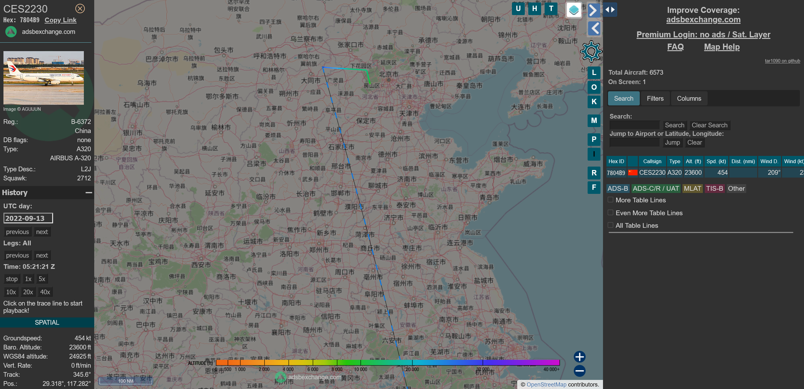

# 官方题解 by ZeroAurora

看到了不少非预期解，于是简要写部分题目的标准题解如下。当然我个人是鼓励多种思路求解的。

## 语文成绩

排名的预期解法是使用 Excel 的 `RANK.EQ()` 函数（在 Excel 2007 及以下版本 是 `RANK()`）

如果在填充的逻辑上出现问题则应该考虑使用单元格绝对引用。

## 社会工程学二题

知道工具的话并不难。

查看 EXIF 获得第一题答案。

根据 EXIF 中的时间和照片上机身的编号查找 ADS-B Exchange。

根据左上角国际航班号搜索即得。[这是 FlightAware 链接](https://zh.flightaware.com/live/flight/CES2230)。

## 我不高兴了

你要用 cat 也行。

## 面纱后面藏着还是面纱

这道题本来不该这么考，但 ltkk 做压缩包的时候没有选择压缩而是选择仅存储，放了个大水。

标准解法是 zip 解压然后查看 `[Content_Types].xml` 内的注释。

## WeakPassword

用户名 `admin`，密码 `password123`。

这是个很常见的弱密码，但是却罕见于密码字典中。不过稍微多换几个字典完全可以解决。 

