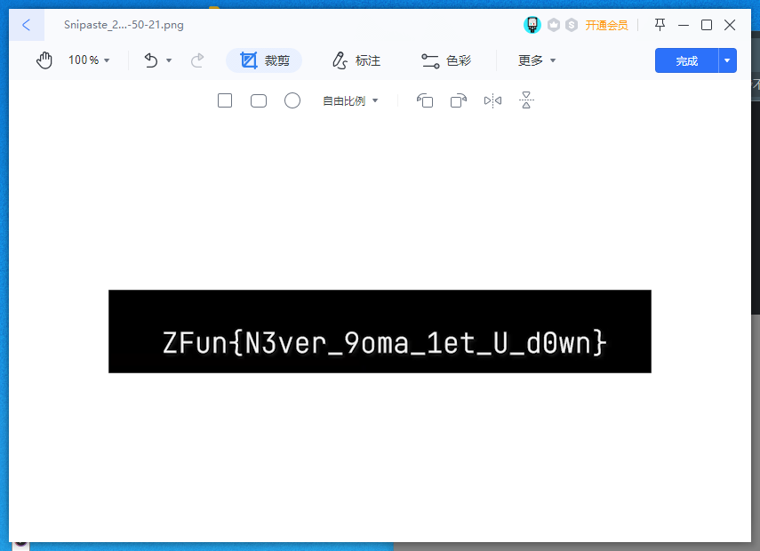
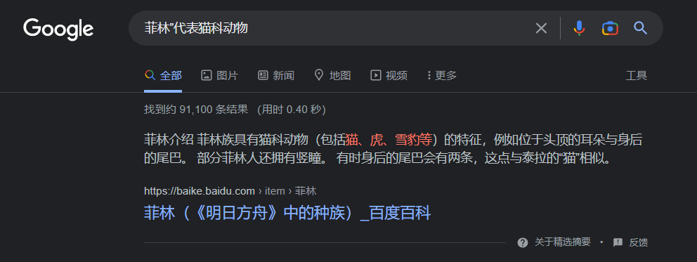
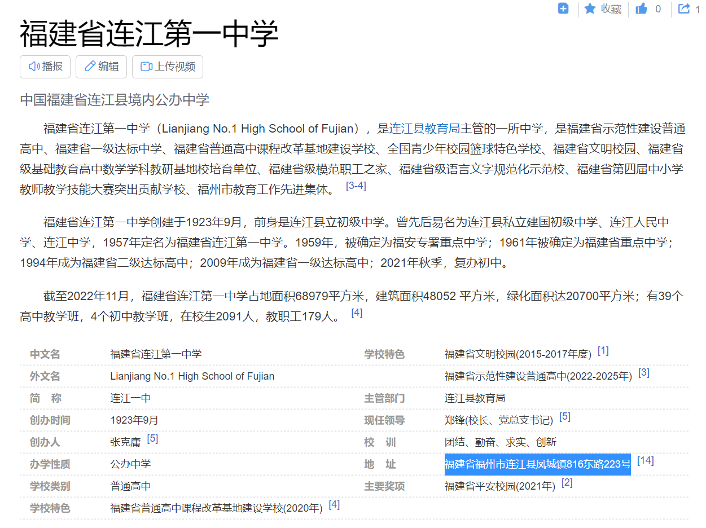
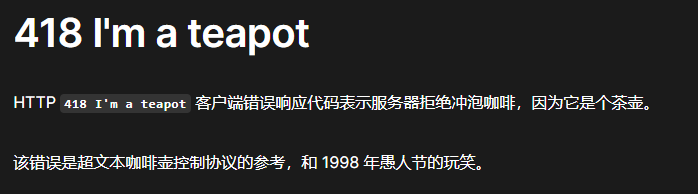
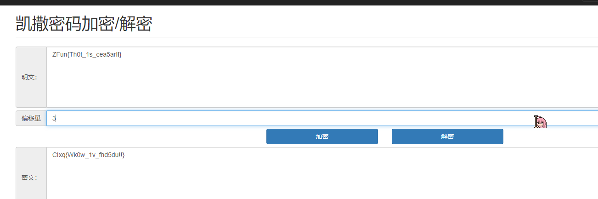
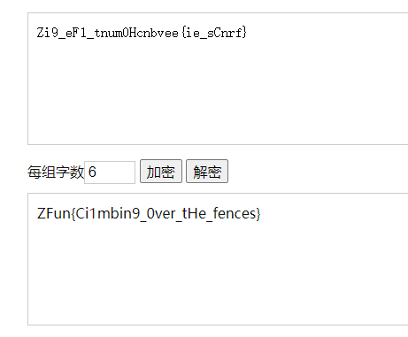
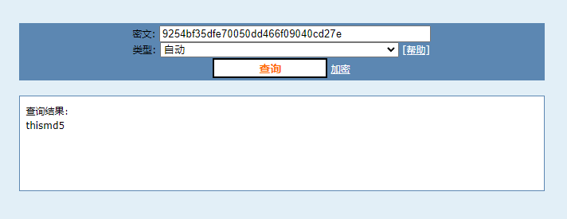
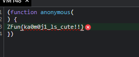
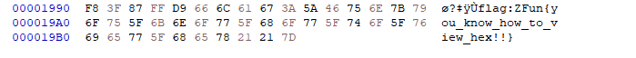

# ZFun 2022 Writeup -- Yang

## 写在前面

这次 ZFun 是被某只猫叫过来的( [@Aw.Cat](https://github.com/htxzdfunny) )，刚好闲的没事干随手写了写

没想到是第二个 AK （（（

简单写个 wp 梳理一下我的做题思路（

## 0-入门

### 0-1 ZFun 101:

直接去拿 flag 就好了（（（

Flag: `ZFun{Lets_GO!}`

### 0-2 PlantsVSZombies?:+

如提示: `打游戏就能获得 flag ，我怎么会做这样的梦`

打游戏打过第一关就好了


Flag: `ZFun{Guess_how_I_made_it?}`

## 1-软件使用

### 1-1 面纱后面藏着什么呢

打开题目文档之后先进行一个 Ctrl-A


将鼠标移动到中间部分发现有白色图形，移开后对所有文字修改颜色


Flag: `ZFun{L00k_6eyOnd_the_ve1l}`

### 1-2 语文成绩

以 `WPS Office` 为例

先把第一个工作表的客观题、主观题、总分用 `SUM` 和填充柄补充好


排名部分可以将所有的分数数值单独 copy 到一张 sheet 中，使用WPS自带的排序功能按照总分重新排序，班名次拉一下顺序序号

再按照题目中给出的同分同名次

自 己 改


最后得到 Flag: `ZFun{5um_thEm_t0GetHer_13782}`

### 1-3 地址栏

直接按照所给信息拼接url: http://42.198.134.118:10001/here/we/go/flag.html

Flag: `ZFun{URLs_Are_3ssen7ial}`

### 1-4 不离不弃

保存视频---打开 pr

找到那一帧 flag 并左右反转

得到Flag



Flag: `ZFun{N3ver_9oma_1et_U_d0wn}`

## 2-菲林问答

*以 Google 搜索为例*

### 1. 既然都叫做菲林问答了，你知道代表“菲林”代表猫科动物的称呼是出自哪一款游戏吗？

直接搜索得到答案: **明日方舟**



### 2. “敖水泱泱，古榕苍苍”，连江一中又在哪里呢？

在 Google 搜索连江一中后，在右侧的资料卡中找到地址，但没有具体到镇

去百度百科找到地址：福建省福州市连江县凤城镇816东路223号

按照题目答案格式要求格式化后

答案为: **福建省福州市连江县凤城镇八一六东路223号**



### 3. 你们的前社长就读于西安电子科技大学，并加入了“西电信息安全协会”。你知道这个协会的英文名缩写是什么吗？

直接搜索"西电信息安全协会"

得到答案: **XDSEC**


### 4. 10 月新番《孤独摇滚》中，作为主角的后藤独是一个吉他技能顶尖的超级社恐。你想知道她的第一把吉他是什么型号的，可是面对着瑟瑟发抖的可爱波奇酱，你真的下的了狠心把吉他抢过来看吗qwq？不妨上网搜一下吧。

按题目提示查询萌百

答案为: **Gibson Les Paul Custom**


### 5. HTTP 协议中有一个概念叫做“状态码”，大家耳熟能详的 404 就是一个 HTTP 状态码（意思是未找到 Not Found）。不过你知道用来表示服务器不能拿来泡咖啡的状态码是什么吗？（笑）

这个梗应该经常看 [http.cat](https://http.cat) 或者水群的人都会能看到（


故答案为: `418`

附MDN的相关解释



### EX. IETF（Internet Engineering Task Force，互联网工程任务组）有时会一反严肃的常态，出版一些有意思的 RFC（Request For Comments，用来标准化地发布互联网规范并得到外界反馈）。上文的“泡咖啡”就是某年的愚人节笑话。这回，它介绍了一个全新的 16 进制表示方式：Bioctal。你能把使用 Bioctal 表示的 10zjvf70042 这个数字转换成 10 进制吗？

直接搜索 Bioctal 后找到 [RFC 页面](https://www.rfc-editor.org/rfc/rfc9226.html)

找到此表后将 Bioctal 转换为正常的16进制


转换后的结果: `10A9FC70042`

再找到16进制转10进制的工具得到答案: `1145141919810`

全部提交后拿到三个Flag

1: `ZFun{WoW_3_Pro6lEms_5olveD!}`

2: `ZFun{Meow_Ca7S_ArE_CUT3!!!}`

3: `ZFun{Nya_N0t_7hAt_Ha2D!!!}`

## 3-计算机技术基础

### 3-1 一闪而过

下载文件后根据题目提示打开 terminal

在 terminal 运行该程序得到 Flag


Flag: `ZFun{Y0u_1ern7_c0mmand_pr0mp7}`

### 3-2 Setup

安装程序后打开安装目录

查看 `flag.txt` 发现如下内容：

```
WkZ1bns2YVNlNjRfaXNfZnVubjl9
你没有弄错，这就是flag
但是似乎需要经过什么处理才能提交哦
```

盲猜一波 Base64

经转换后拿到Flag: `ZFun{6aSe64_is_funn9}`

### 3-3 CBeginner

找到在线 C Compiler 并运行题目所给代码


得到Flag: `ZFun{You_know_to_compile_c!!}`

## 4-密码学

### 4-1 凯撒是谁？真不熟

按题目及提示，找到在线凯撒密码工具



解密得到Flag: `ZFun{Th0t_1s_cea5ar!!}`

### 4-2 这是什么铸币

搜索猪圈密码，找到 WikiPedia 页

可以选择手撕密码（

记得用 `ZFun{}` 把密码包起来

最终Flag为: `ZFun{pigpencipheriscool}`

### 4-3 神经仿射

直接搜索仿射密码解密


使用在线工具拿到Flag: `ZFun{i_lOve_aFfIne}`

### 4-4 栅栏有1.5格高

找到栅栏密码解密工具



Flag: `ZFun{Ci1mbin9_0ver_tHe_fences}`

### 4-5 文明做人，从你我做起

由题目所给文件名猜测是 `md5` 值

搜索 `md5 decrypt`

使用 cmd5 对其解密



Flag: `ZFun{thismd5}`

## 5-社会工程学

### 5-1 让我看看你爱不爱国

使用在线EXIF查看工具打开该照片


分别拿到：制造商(`Xiaomi`), 型号(`M2007J17C`)

根据型号去 Google 反查

得到屏幕分辨率为 `2400x1080`

最终Flag: `ZFun{Xiaomi_M2007J17C_2400x1080}`

### 5-2 盒打击已就绪

~~等待补充~~ 太长了懒得写（

最快的方法是用 ADS-B Exchange 直接找航班信息

不过你也可以像我一样整理出这架飞机在当天的全部航程

~~（因为时间太长了所以忘了）~~

总之就是通过照片中给出的飞机编号：`B-6372` 来找，然后根据照片推断出是下午三点且正在下机，找到对应时间的对应航班

附个之前推出来的该飞机在当天的全部航班：


最终Flag: `ZFun{FOC_MU2230_XIY}`

### 6-编码与隐写

### 6-1 qwq

一眼顶针，鉴定为 jsfuck

直接浏览器内 F12 打开 Console 执行即可

会发现抛出 exception

点开具体的函数，得到 Flag: `ZFun{ka0m0j1_ls_cute!!}`



### 6-2 我不高兴了

使用 `HxD` 或其他可以以 16 进制打开文件的编辑器打开此照片

拉到最后找到 Flag: `ZFun{you_know_how_to_view_hex!!}`



### 6-3 这是什么？失忆喷雾，喷一下。

速通解法：直接使用 Postman 拉取链接

得到 Flag: `ZFun{PNGISCOOL}`


### 6-4 面纱后面藏着还是面纱

个人解法：使用 `VSCode` 以文本方式打开文档

搜索 `ZFun{`

得到 `ZFun{f1@g_1n_xml_c0mment!}`


## EX1-程序设计入门

对于 `Python` 玩家:

这部分题其实可以去 `VSCode` 或者 `PyCharm` 并使用 `Github Copilot` 直接 copy lot （

对于 `C/C++` 玩家:

那你可能不需要看这部分wp（

这部分就直接给代码了

### EX1-1 Hello World

```python
print("Hello, World!")
# Flag: ZFun{You_Are_The_W0RLD}
```

### EX1-2 A+B Problem

```python
nums = input().split()
print(int(nums[0]) + int(nums[1]))
# Flag: ZFun{A_Plus_B_Equals_to_WhA7?}
```

### EX1-3 时间格式转换

```python
seconds = int(input())
# print the time in the format HH:MM:SS
print(f"{seconds // 3600}:{seconds % 3600 // 60}:{seconds % 60}")
# Flag: ZFun{C0NVER51ON!_f3e8cb6f964d86dc51570dcc1587c7e4}
```

### EX1-4 两点之间的距离

```python
from math import sqrt

nums = input().split()
a = (float(nums[0]) - float(nums[2])) ** 2
b = (float(nums[1]) - float(nums[3])) ** 2
print(f"{sqrt(a + b):.6f}")
# Flag: ZFun{5_Centimeters_Per_Second_21a1389938334234f3dcf078f577d36f}
```

### EX1-5 算日期

```python
# count the day of the year with input data: YYYY/MM/DD
nums = input().split("/")
year = int(nums[0])
month = int(nums[1])
day = int(nums[2])
# calculate the day of the year
days = 0
for i in range(1, month):
    if i in [1, 3, 5, 7, 8, 10, 12]:
        days += 31
    elif i in [4, 6, 9, 11]:
        days += 30
    else:
        if year % 4 == 0 and year % 100 != 0 or year % 400 == 0:
            days += 29
        else:
            days += 28
days += day
print(days)

# Flag: ZFun{365_or_366_58c76ea19f702c658efb067dcd873896}
```

### EX1-6 LiLang

个人使用 Kotlin 解法

```kotlin
fun main() {
    var strList = mutableListOf<String>().apply { (1..10).forEach { _ -> add(readln()) } }

    val longest = strList.maxByOrNull { it.length }!!
    val longestLength = longest.length

    strList = mutableListOf<String>().apply { (1..10).forEach { _ -> add(readln()) } }

    val shortest = strList.minByOrNull { it.length }!!
    val shortestLength = shortest.length

    val sb = StringBuilder().apply {
        (0 until longestLength).forEach {
            if (it % 2 == 0) append(shortest[(it / 2) % shortestLength])
            append(longest[it])
        }
    }

    println(sb)
}
```

stdin:
```
Er>RR1ZFn{owyo_kowsomuh_bot_ilngbu_pthn_s_eterthn_t}#PC`w,
|M&dV@ABy+TKq.A[fVB,$h/~|6cC?kr:n/$Q0>ki~/f5>]@v
bt{@"=7{98x+Q<XxD0I(~:2@,sy'D_8[kSNTGJ@_*e.e!
:]5(4iH%VCQxMs-U]VLMF&.W0k!jVQ~]TclE2Z:3;O/l#z)[jPIgO
zTHE`;HbC%{aX.)(^%VN<77(VlTADQnDR{9Uk7
@xeUHomQ4HWncl[c2'^?*)4zL9)x;D<
"uMN6P.:K:W{xv6%h{e`c4@#=n#j_J$wnnd^m_3!9x;|'SA@
PX%_VVmn9B=WL`\ESxM/O3b)w(=WDm^&hpUjfx$ZQ#hEIM.3:^D8XY<p{
n=`Z&u?Xsjq#bl(CMA`hulmf#VD%]xw7gu|>;!rp
1_g+X7":V2D}hG<%x;?dMwzFL<&E:T#\oqFBOUHWE5r<qD0ZehG
>FU}*5$+E"OYua<e_L4vC0-A%qlsIi@DB
?clW;`KV(c5'9rSwT:H;=ktC&"4>o~`KO*?nh
ew(JOth+)mV47v'p9T.yy+V.9CKz*$,o
wCM77:^q0Br6YF?2}><oE_E@v&5g'9inES[
A1C[f:XIdTki5-(dY7((`DZb\)JW_R,)et_
?=.CZ[T/hA$u=K'e7|t)-2xsMlh>~I`&+.k]
AKI75D/mesC1*3TghX@6K/8:I^\;@*gA"<NMl
OA$cuw_un__caula_tyoibt_ai#0M/
JD`\F!*^yf#imO8Wf\;yz2ov8A3ls0!F"^oPuSr3'=gB>
j*.DtBChg='tOg>VI5&w)@LV(!}Cu!3q3q&rTd\$2
```

stdout:
```
OErA>R$R1cZFun{wow_you_know_so_much_about_lilang_but_python_is_better_than_it}##P0C`Mw,
```

截取 `ZFun` 部分

Flag: ZFun{wow_you_know_so_much_about_lilang_but_python_is_better_than_it}

## EX2-HTTP 协议基础

### EX2-1 SimpleHTTP

第一轮: 跟随 endpoint: `/flag1`

第二轮: 向 `/f1ag2` POST 任意内容

第三轮: GET `flag333` 然后查看 cookie

第四轮: GET `/f_l_a_g_4` 然后查看 header

Response text: `But how does the server send cookies to us?`

Quote in headers: `...through_the_magic_of_Headers`

Flag: `ZFun{You_learnt_s1mple_HTTP!}`

### EX2-2 原地 TP

使用 Postman 直接 GET 这个 url ，记得关闭自动重定向

查看 Header 拿到 Flag: `ZFun{the_server_is_written_by_ltkk_in_5_minutes_and_there_is_no_bug}`

## EX3-网络安全入门

### EX3-1 Web - WeakPassword

JUST FOLLOW THE HINTS

... AND UR FIRST IMPRESSION

username: `admin`

password: `password123`

Flag: `ZFun{DONT_use_W3AK_PASSW0RD}`

### EX3-2 Misc - 让我康康！

下载下来图片，习惯性地用截图软件看一下每个地方的 RGB 值，发现会有变化

打开PS

曲线直接拉高


Flag: `ZFun{miku_is_so_cute_and_congratulate_for_you}`

### EX3-3 Reverse - Reverse.NET

使用 Rider 打开 C# 源代码

通过查看前面的代码发现是 `xor` 加密

捋一下代码逻辑，按照所给 int[] 的长度再次生成一个 int[] 然后重新进行 xor

修改后的代码：

```csharp
using System.Text;
static class Programs
{
    static int[] GenerateIntList(int l1111l1)
    {
        var l1l1ll1 = new int[l1111l1];
        var last = 0;
        for (int i = 0; i < l1111l1; i++)
        {
            last = ((last * 2 + 35) / 3 + i) % 256;
            l1l1ll1[i] = last ^ i;
        }
        return l1l1ll1;
    }

    static void Xor(int[] ll1l1l1l1, int[] llll11111)
    {
        for (int i = 0; i < ll1l1l1l1.Length; i++)
        {
            ll1l1l1l1[i] ^= llll11111[i];
        }
    }

    static byte[] IntArrayToByteArray(int[] ll1l1l1l1)
    {
        var output = new byte[ll1l1l1l1.Length];
        for (int i = 0; i < ll1l1l1l1.Length; i++)
        {
            output[i] = (byte)ll1l1l1l1[i];
        }
        return output;
    }
    
    static void Main(string[] args)
    {
        var answer = new[] { 81, 83, 108, 77, 90, 94, 78, 65, 94, 77, 64, 82, 108, 46, 20, 55, 41, 48, 36, 53, 34, 34, 20, 0, 9, 22, 7, 3, 22, 1, 52, 5, 34, 0, 192, 212, 203, 206, 217, 199, 228, 214, 192, 232, 197, 234, 249, 254, 196, 250, 226, 244, 250, 242 };
        Xor(answer, GenerateIntList(answer.Length));
        Console.WriteLine(Encoding.UTF8.GetString(IntArrayToByteArray(answer)));
        
        // Flag: ZFun{reverse_a_program_written_by_csharp_is_very_easy}
    }
}
```

### EX3-4 Crypto - Signin

直接 Google `use n and c to decrypt rsa`，找到一个 [在线工具](https://www.dcode.fr/rsa-cipher)

直接扔进去 `C` `E` `N` 的值即可


Flag: `ZFun{wow_you_have_know_what_is_RSA!}`

## Final-比赛最后

填写问卷

Flag: `ZFun{Thank_U_4_Play1ng!}`