# ZFun 2022 Writeup -- Yang

# EX部分暂未完成，先挖个坑在这里（

## 0-入门

### 0-1 ZFun 101:

直接去拿flag就好了（（（

Flag: `ZFun{Lets_GO!}`

### 0-2 PlantsVSZombies?:+

如提示：`打游戏就能获得flag，我怎么会做这样的梦`

打游戏打过第一关就好了


Flag: `ZFun{Guess_how_I_made_it?}`


## 1-软件使用

### 1-1 面纱后面藏着什么呢

打开题目文档之后先进行一个Ctrl-A

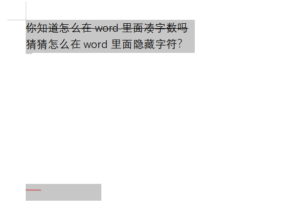

将鼠标移动到中间部分发现有白色图形，移开后对所有文字修改颜色

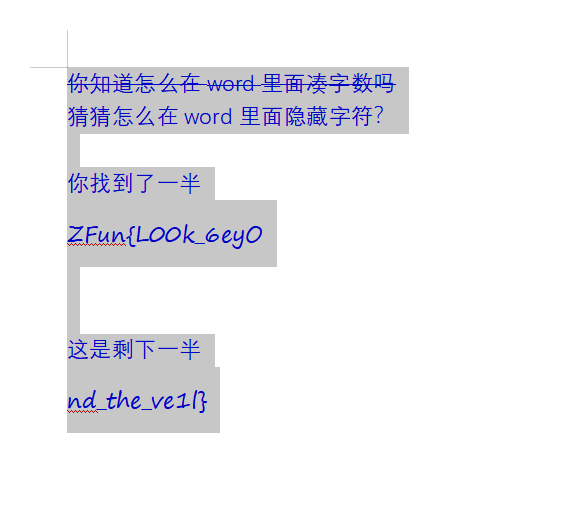

Flag: `ZFun{L00k_6eyOnd_the_ve1l}`

### 1-2 语文成绩

以WPS Office为例

先把第一个工作表的客观题、主观题、总分用SUM和填充柄补充好

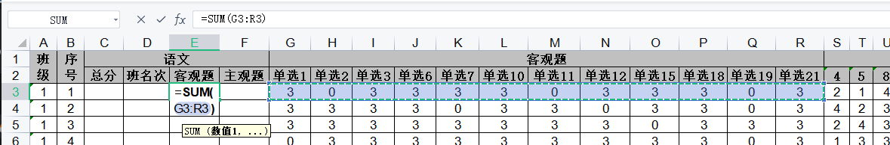

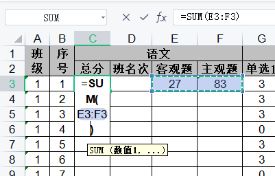

排名部分可以将所有的分数数值单独copy到一张sheet中，使用WPS自带的排序功能按照总分重新排序，班名次拉一下顺序序号

再按照题目中给出的同分同名次

自 己 改


最后得到Flag: `ZFun{5um_thEm_t0GetHer_13782}`

### 1-3 地址栏

直接按照所给信息拼接url：http://42.198.134.118:10001/here/we/go/flag.html

Flag: `ZFun{URLs_Are_3ssen7ial}`

### 1-4 不离不弃

保存视频---打开pr

找到那一帧flag并左右反转

得到Flag

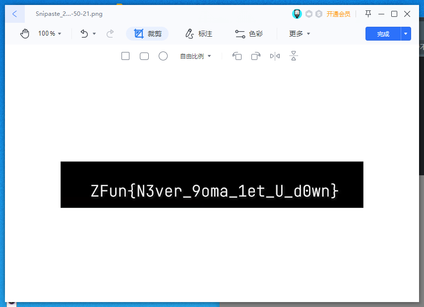

Flag: `ZFun{N3ver_9oma_1et_U_d0wn}`

## 2-菲林问答

**——以Google搜索为例**

### 1. 既然都叫做菲林问答了，你知道代表“菲林”代表猫科动物的称呼是出自哪一款游戏吗？

直接搜索得到答案: **明日方舟**

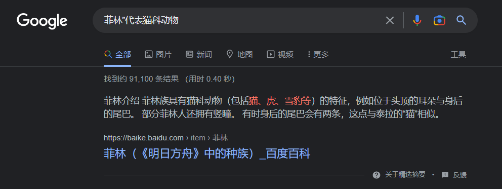

### 2. “敖水泱泱，古榕苍苍”，连江一中又在哪里呢？

在Google搜索连江一中后，在右侧的资料卡中找到地址，但没有具体到镇

去百度百科找到地址：福建省福州市连江县凤城镇816东路223号

按照题目答案格式要求格式化后

答案为: **福建省福州市连江县凤城镇八一六东路223号**

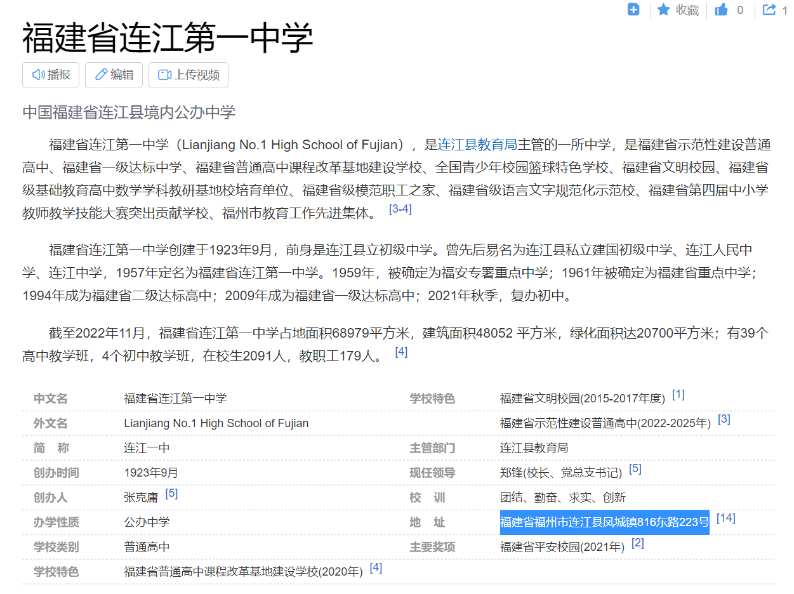

### 3. 你们的前社长就读于西安电子科技大学，并加入了“西电信息安全协会”。你知道这个协会的英文名缩写是什么吗？

直接搜索"西电信息安全协会"

得到答案: **XDSEC**

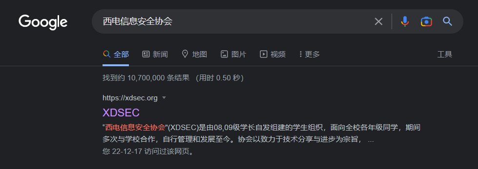

### 4. 10 月新番《孤独摇滚》中，作为主角的后藤独是一个吉他技能顶尖的超级社恐。你想知道她的第一把吉他是什么型号的，可是面对着瑟瑟发抖的可爱波奇酱，你真的下的了狠心把吉他抢过来看吗qwq？不妨上网搜一下吧。

按题目提示查询萌百

答案为: **Gibson Les Paul Custom**

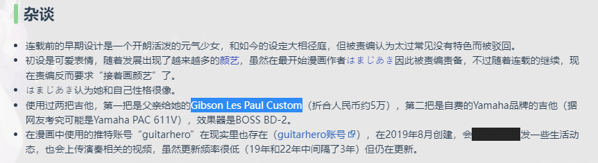

### 5. HTTP 协议中有一个概念叫做“状态码”，大家耳熟能详的 404 就是一个 HTTP 状态码（意思是未找到 Not Found）。不过你知道用来表示服务器不能拿来泡咖啡的状态码是什么吗？（笑）

这个梗应该经常看 [http.cat](https://http.cat) 或者水群的人都会能看到（


故答案为:`418`

附MDN的相关解释

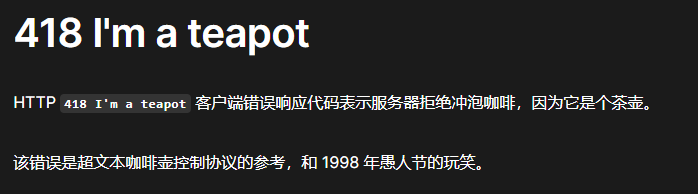

### EX. IETF（Internet Engineering Task Force，互联网工程任务组）有时会一反严肃的常态，出版一些有意思的 RFC（Request For Comments，用来标准化地发布互联网规范并得到外界反馈）。上文的“泡咖啡”就是某年的愚人节笑话。这回，它介绍了一个全新的 16 进制表示方式：Bioctal。你能把使用 Bioctal 表示的 10zjvf70042 这个数字转换成 10 进制吗？

直接搜索 Bioctal 后找到 [RFC页面](https://www.rfc-editor.org/rfc/rfc9226.html)

找到此表后将 Bioctal 转换为正常的16进制

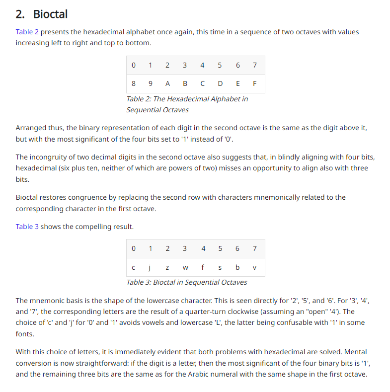

转换后的结果: `10A9FC70042`

再找到16进制转10进制的工具得到答案: `1145141919810`

全部提交后拿到三个Flag

1: `ZFun{WoW_3_Pro6lEms_5olveD!}`

2: `ZFun{Meow_Ca7S_ArE_CUT3!!!}`

3: `ZFun{Nya_N0t_7hAt_Ha2D!!!}`

## 3-计算机技术基础

### 3-1 一闪而过

下载文件后根据题目提示打开terminal

在terminal运行该程序得到Flag

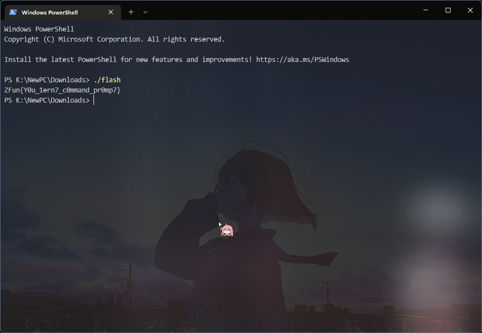

Flag: `ZFun{Y0u_1ern7_c0mmand_pr0mp7}`

### 3-2 Setup

安装程序后打开安装目录

查看flag.txt发现如下内容：

```
WkZ1bns2YVNlNjRfaXNfZnVubjl9
你没有弄错，这就是flag
但是似乎需要经过什么处理才能提交哦
```

盲猜一波Base64

经转换后拿到Flag: `ZFun{6aSe64_is_funn9}`

### 3-3 CBeginner

找到在线 C Compiler 并运行题目所给代码


得到Flag: `ZFun{You_know_to_compile_c!!}`

## 4-密码学

### 4-1 凯撒是谁？真不熟

按题目及提示，找到在线凯撒密码工具

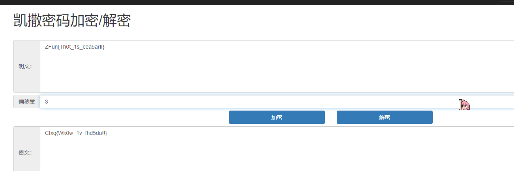

解密得到Flag: `ZFun{Th0t_1s_cea5ar!!}`

### 4-2 这是什么铸币

搜索猪圈密码，找到 WikiPedia 页

可以选择手撕密码（

记得用ZFun{}把密码包起来

最终Flag为: `ZFun{pigpencipheriscool}`

### 4-3 神经仿射

直接搜索仿射密码解密

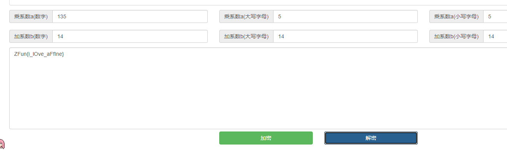

使用在线工具拿到Flag: `ZFun{i_lOve_aFfIne}`

### 4-4 栅栏有1.5格高

找到栅栏密码解密工具

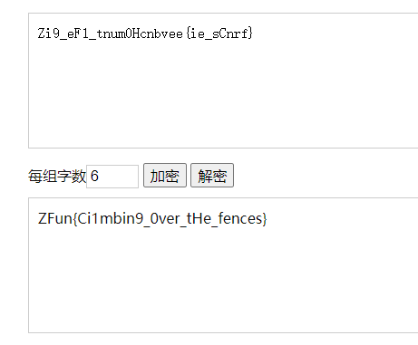

Flag: `ZFun{Ci1mbin9_0ver_tHe_fences}`

### 4-5 文明做人，从你我做起

由题目所给文件名猜测是 md5 值

搜索 md5 decrypt

使用 cmd5 对其解密

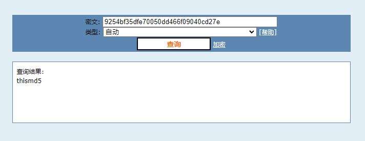

Flag: `ZFun{thismd5}`

## 5-社会工程学

### 5-1 让我看看你爱不爱国

使用在线EXIF查看工具打开该照片


分别拿到：制造商( `Xiaomi` ), 型号( `M2007J17C` )

根据型号去Google反查

得到屏幕分辨率为 `2400x1080`

最终Flag: `ZFun{Xiaomi_M2007J17C_2400x1080}`

### 5-2 盒打击已就绪

~~等待补充~~ 太长了懒得写（

最快的方法是用 ADS-B Exchange 直接找航班信息

不过你也可以像我一样整理出这架飞机在当天的全部航程

~~（因为时间太长了所以忘了）~~

总之就是通过照片中给出的飞机编号：`B-6372` 来找，然后根据照片推断出是下午三点且正在下机，找到对应时间的对应航班

附个之前推出来的该飞机在当天的全部航班：

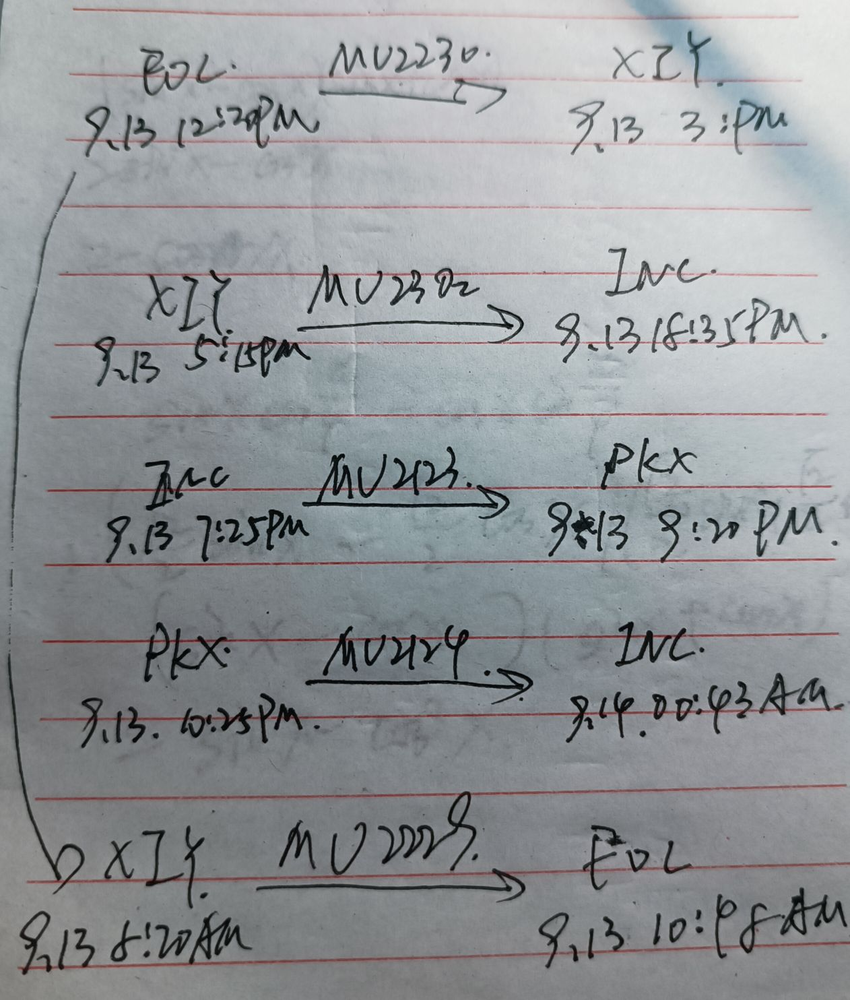

最终Flag: `ZFun{FOC_MU2230_XIY}`

### 6-编码与隐写

### 6-1 qwq

一眼顶针，鉴定为jsfuck

直接浏览器内F12打开Console执行即可

会发现抛出exception

点开具体的函数，得到Flag: `ZFun{ka0m0j1_ls_cute!!}`

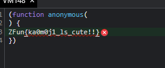

### 6-2 我不高兴了

使用HxD或其他可以以16进制打开文件的编辑器打开此照片

拉到最后找到Flag: `ZFun{you_know_how_to_view_hex!!}`

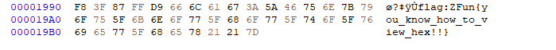

### 6-3 这是什么？失忆喷雾，喷一下。

速通解法：直接使用Postman拉取链接

得到Flag: `ZFun{PNGISCOOL}`


### 6-4 面纱后面藏着还是面纱

个人解法：使用VSCode以文本方式打开文档

搜索`ZFun{`

得到`ZFun{f1@g_1n_xml_c0mment!}`

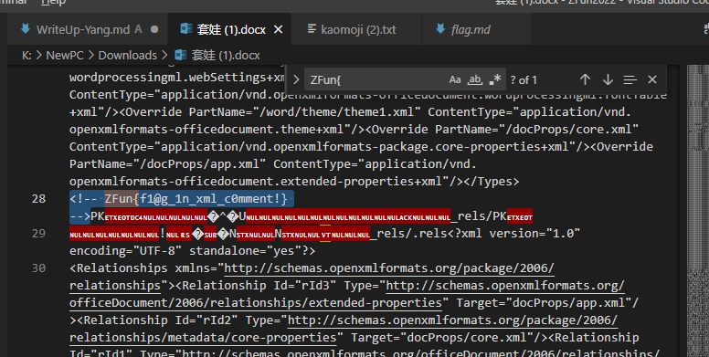
